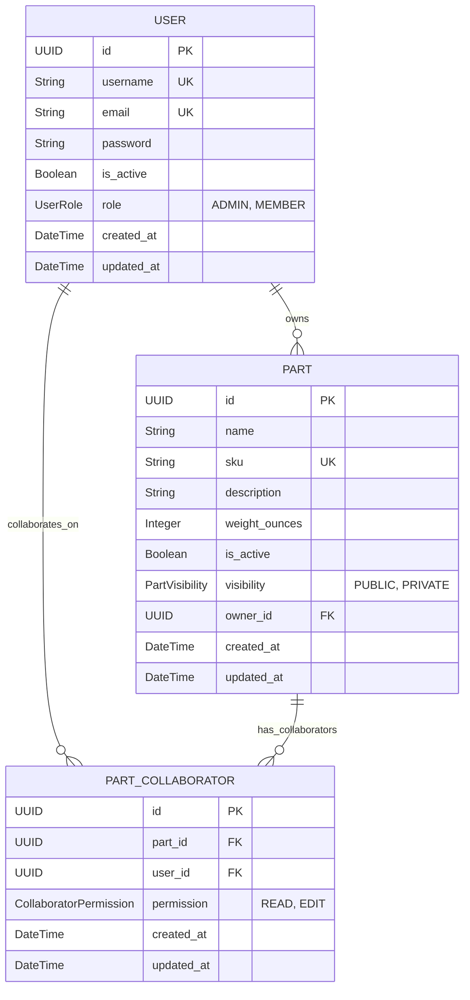

# Parts API

A FastAPI application for managing parts.

## Table of Contents

- [Getting Started](#getting-started)
- [Live API Documentation](#live-api-documentation)
  - [Credentials](#credentials)
  - [How to Authenticate on OpenAPI](#how-to-authenticate-on-openapi)
- [Local API Documentation](#local-api-documentation)
  - [Prerequisites](#prerequisites)
  - [Local Setup with Docker](#local-setup-with-docker)
  - [Local Test Prerequisites](#local-test-prerequisites)
  - [Running Tests](#running-tests)
  - [API Workflow Concept](#api-workflow-concept)
  - [Database Schema](#database-schema)
- [Development Philosophy](#development-philosophy)
  - [It seems you are just adding a lot of libraries to make the project bigger?](#it-seems-you-are-just-adding-a-lot-of-libraries-to-make-the-project-bigger)
    - [Libraries Used](#libraries-used)
- [The Work Never Stops](#the-work-never-stops)

## Getting Started

This section guides you through setting up the project for local development using Docker 
(or you can go directly to the LIVE API and have an easier life).

## Live API Documentation

You can interact with the live deployed version of this API using its OpenAPI documentation:

[https://parts-api.onrender.com/docs](https://parts-api.onrender.com/docs)

**NOTE: It can take a moment to load the first time**

### Credentials

Credentials for accessing the endpoints right away on the live API can be found here:

[https://share.1password.com/s#sB-fgURCdKKtEI5-0gohC3XNTxmy3UklM3PqzyjHRGw](https://share.1password.com/s#sB-fgURCdKKtEI5-0gohC3XNTxmy3UklM3PqzyjHRGw)

### How to Authenticate on OpenAPI

After getting the credentials you can authenticate following the next steps:

1. You will see a green `Authorize` on the top right. Click it.
2. You will see `username` and `password` text-boxes, insert any `username/password` combination from the credentials file.
3. That is all! Just click the green `Authorize` at the bottom and you will be logged in.


## Local API Documentation

### Prerequisites

- Docker Desktop

### Local Setup with Docker

The project includes a `Makefile` to simplify common operations including Docker.

1.  **Clone the repository:**
    ```bash
    git clone https://github.com/BranddiazTL/parts-api.git
    cd parts-api
    ```

2.  **Build and start the services:**
    This command builds the Docker images (if they don't exist, make sure to have docker installed and running) and starts the application (API) and any associated services (in this case just the PostgresDB)
    ```bash
    make up
    ```

3.  **View available commands:**
    To see all available Make commands and their descriptions, run:
    ```bash
    make help
    ```

4.  **Stop the services:**
    To stop the running Docker containers:
    ```bash
    make down
    ```

5.  **Access the application:**
    Once the containers are running, the API should be accessibly at `http://localhost:8000/docs`

#### Local Test Prerequisites

If you want to run tests locally, you need to have [Poetry](https://python-poetry.org/docs/#installation) installed and all dependencies set up. Before running `make test` locally, do the following:

1. **Install Poetry** (if not already installed):
    ```bash
    pip install poetry
    ```
   **NOTE: If you don't have pip installed follow the Poetry installation guide/link above**
2. **Install dependencies:**
    ```bash
    poetry install
    ```

#### Running Tests

The project uses a separate Docker Compose configuration (`docker-compose.test.yml`) for running tests to ensure a clean, isolated environment with a dedicated test database.

1.  **Start the test environment:**
    This command builds necessary images and starts the test-db
    ```bash
    make test-up
    ```

2.  **Execute the test suite:**
    This command runs `pytest` tests.
    ```bash
    make test
    ```

3.  **Stop and remove the test environment:**
    After running tests, clean up the test-db containers.
    ```bash
    make test-down
    ```

### API Workflow Concept

Once the API is running, the workflow focuses on managing parts with different visibility levels and user roles:

1.  **User Roles**: Users can be `ADMIN` or `MEMBER`.
    *   `ADMIN`: Can view and manage **all** parts, regardless of visibility or ownership.
    *   `MEMBER`: Can manage parts they own, parts they are explicitly added to as collaborators, and can view/edit `PUBLIC` parts based on collaborator permissions (default is only to view).
2.  **Part Creation**: Any authenticated user can create a part (e.g., `POST /parts`). Newly created parts have an `owner_id` linking them to the creator (user_id).
3.  **Part Visibility**:
    *   `PUBLIC`: These parts are visible/accessible across the organization (company-wide). By default, parts are `PUBLIC`.
    *   `PRIVATE`: These parts arr intended for specific teams or individuals (department-wide in production API). Access is restricted to the `owner`, explicitly added `Collaborators`, and `ADMIN` users.
4.  **Collaboration**: For `PRIVATE` parts (or to add specific permissions on `PUBLIC` parts), owners or admins can add other users as collaborators (e.g., `POST /parts/{part_id}/collaborators`).
    *   Collaborators are granted specific `permission` levels (`READ` or `EDIT`) on that particular part.

This model allows for both company-wide shared parts and privately managed parts controlled by owners and designated collaborators, overseen by administrators.

### Database Schema

The following diagram illustrates the relationships between the main database tables:



## Development Philosophy

### It seems you are just adding a lot of libraries to make the project bigger?

Yes, it can be seen like that, but why did we add them? here some insight:

#### Libraries Used

We leverage several libraries to improve development practices, code quality, and maintainability. Here's a little why each was chosen:

-   **Coverage.py (`coverage`)**:
    *   **Motivation**: Ensures our tests effectively cover the codebase by reporting which lines are executed. Helps pinpoint areas needing more tests.

-   **Loguru (`loguru`)**:
    *   **Motivation**: Provides a more intuitive and powerful logging experience compared to the standard library, simplifying log setup and usage.

-   **Pre-Commit (`pre-commit`)**:
    *   **Motivation**: Automates code quality checks (like linting and formatting) before each commit, catching issues early and saving CI/CD resources.

-   **Commitizen (`commitizen`)**:
    *   **Motivation**: Enforces a consistent commit message format, enabling automatic changelog generation and adherence to Semantic Versioning (SemVer) and PEP 440. (avoids "changes" and  "." commits with 4k lines changed)

-   **Ruff (`ruff`)**:
    *   **Motivation**: Acts as an extremely fast (looking at you Black/Flake8) linter and formatter, enhancing code readability and consistency.

-   **Bandit (`bandit`)**:
    *   **Motivation**: Focuses specifically on identifying common security vulnerabilities in Python code, complementing general linting tools and making live more secure (Bandit? more like Batman).

-   **Pytest (`pytest`)**:
    *   **Motivation**: Offers a feature-rich and less boilerplate-heavy testing framework. Writing tests avoids future pain, and features like parametrization simplify test creation.

-   **Pydantic (`pydantic`)**:
    *   **Motivation**: Enables robust data validation and settings management through Python type annotations, catching configuration errors before runtime (Is like having Go at home).

-   **Changelog Management**:
    *   **Motivation**: Maintains a standardized `CHANGELOG.md` (following Keep a Changelog principles), automatically updated using Commitizen based on commit history (so easy to handle).

## The Work Never Stops

This section outlines potential future improvements for the `parts-api`:

-   **Part Category Classification**: Implement a system (perhaps using tags or a dedicated model) to categorize parts, allowing for better organization and filtering.
-   **Bulk Part Creation**: Introduce an endpoint for creating multiple parts simultaneously, potentially using background tasks with Redis queues (e.g., Celery or FastAPI's BackgroundTasks) for efficient processing of large requests.
-   **Enhanced Authentication Security**: Strengthen password hashing by incorporating salting and possibly peppering techniques to provide greater protection.
-   **Increased Test Coverage**: Aim for and achieve a test coverage over 90% to ensure higher code reliability and catch regressions more effectively.
-   **Multi-Environment Support**: Expand configuration management to explicitly support `staging` and multiple `development` environments alongside the existing `local` and `production` setups.
-   **Detailed Changelogs**: Implement mechanisms to track changes to individual parts (part lifecycle) and possibly maintain a separate changelog detailing contributions or significant actions by collaborators.
-   **Structured Logging**: Migrate from Loguru to `structlog` to produce structured (e.g., JSON) logs. This facilitates easier parsing, querying, and analysis in log aggregation platforms like Datadog, Grafana Loki, or the ELK stack.
-   **Testing Documentation**: Create a dedicated `README.md` within the `tests/` directory explaining the testing strategy, how to run specific tests, fixtures usage, and why we use Factories and Fixtures that way.
-   **Client IDs**: Add a client header to authenticate request from other API and for public/open endpoints.

                                        THE END